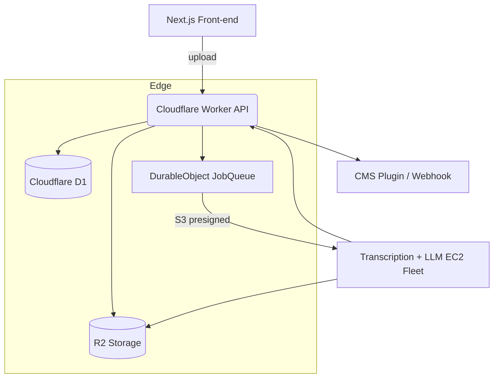

# Podcasteo – Product Requirements Document (PRD)

*Last updated: 22 Jun 2025*

---

## 1. Purpose & Vision

Podcasteo will turn podcast/audio content into **search‑ready and generative‑engine‑ready (GEO) web assets** in minutes, letting content teams unlock organic discovery and lead‑gen without extra writers. We will do this via a pipeline that ingests audio, produces brand‑safe, SEO/GEO‑optimised pages, and publishes directly to the customer’s CMS.

> **North‑star metric**: Minutes of audio processed that result in live, indexed pages.

---

## 2. Goals & Success Criteria

| Goal                   | KPI                              | Target (12 months post‑GA) |
| ---------------------- | -------------------------------- | -------------------------- |
| Revenue sustainability | MRR                              | **\$50 k**                 |
| Product adoption       | Customers with ≥4 episodes/mo    | **300**                    |
| Quality                | Mean Work Error Rate (WER)       | **≤12 %** (English)        |
| Operational cost       | Gross margin                     | **≥65 %**                  |
| Compliance             | Google manual‑action occurrences | **0**                      |

---

## 3. Market & Personas

### 3.1 Primary Persona – **Content/SEO Lead (SaaS)**

* KPIs: Organic traffic growth, MQLs, publishing cadence.
* Pains: Writer bandwidth, algorithm changes, compliance pressure.

### 3.2 Secondary Persona – **Podcast Agency Owner**

* KPIs: Client retention, service margin, differentiation.
* Pains: Manual show-note labour, ad‑ops requests, rapid turnaround.

### 3.3 Tertiary Persona – **Network Ops / Compliance Manager**

* KPIs: Accessibility compliance, brand‑safety, ad transcript availability.

---

## 4. Problem Statement

1. **Hidden value** – Podcast content is invisible to classic search and emerging generative engines.
2. **Manual effort** – Crafting SEO‑optimised show notes costs 2‑4 hrs/episode.
3. **Quality bar** – Google’s 2024 spam update penalises thin, automated pages; teams need AI **plus** editorial control.

---

## 5. Solution Overview

1. **Ingest** audio/RSS/YouTube → Whisper STT.
2. **Analyse** with embeddings + LLM → extract topics, FAQs, quotes, entities.
3. **Compose** long‑form summary, FAQ, quote blocks, internal‑link map, JSON‑LD.
4. **Review** in web UI (human‑in‑loop) with brand‑safety flags.
5. **Publish** via CMS plugins/API; track indexing and GEO visibility.

---

## 6. Functional Requirements

### 6.1 Core Features (MVP)

| ID   | Feature             | Description                                         | Priority |
| ---- | ------------------- | --------------------------------------------------- | -------- |
| F‑1  | File & RSS ingest   | Upload MP3/WAV, paste RSS feed or YouTube link      | P0       |
| F‑2  | Transcription       | Whisper‑large v3 (batch GPU) with diarisation       | P0       |
| F‑3  | Topic extraction    | Embeddings + clustering to map search intents       | P0       |
| F‑4  | Content generation  | LLM (GPT‑4o) produces summary article, FAQ, quotes  | P0       |
| F‑5  | Brand‑safety scan   | Profanity, negative sentiment, banned terms         | P0       |
| F‑6  | Review UI           | Accept/reject blocks, live diff, tone switcher      | P0       |
| F‑7  | CMS publish         | WordPress, Ghost, Webflow plugins + Markdown export | P0       |
| F‑8  | Usage‑based billing | Stripe metered & plan minutes, VAT invoices         | P0       |
| F‑9  | Analytics           | Page index status, keyword wins, GEO snippets       | P1       |
| F‑10 | Desktop recorder    | Electron app push‑to‑Podcasteo                      | P2       |

### 6.2 Non‑functional Requirements

| Category     | Requirement                                          |
| ------------ | ---------------------------------------------------- |
| Performance  | Transcribe + draft ≤ real‑time × 1.5 for 60‑min file |
| Accuracy     | WER ≤ 12 %; hallucination flagging rate ≥ 95 %       |
| Security     | GDPR, SOC‑2 Type I roadmap; audio encrypted at rest  |
| Availability | 99.5 % monthly uptime (Workers edge + GPU batch)     |
| Scalability  | Horizontal GPU queue; stateless Workers for API      |

---

## 7. Tech Stack & Architecture

### 7.1 High‑level Stack

| Layer            | Technology                                | Rationale                       |
| ---------------- | ----------------------------------------- | ------------------------------- |
| Front‑end        | Next.js + Radix UI                        | Fast SSR, accessible components |
| Auth             | Clerk                                     | Out‑of‑box social & orgs        |
| API              | Cloudflare Workers + Durable Objects      | Global edge, low cold‑start     |
| Transcription    | Python queue on AWS A10G spot (Docker)    | Cheapest GPU \$/min             |
| LLM / Embeddings | OpenAI `gpt‑4o`, `text‑embedding‑3‑small` | Best quality/cost               |
| Data             | Cloudflare R2 (hot) → Backblaze B2 (cold) | Low egress; GDPR region         |
| DB               | Cloudflare D1 (SQLite)                    | Simplicity for SaaS metadata    |
| Billing          | Stripe Billing (metered)                  | Handles usage & VAT             |
| Observability    | Grafana Cloud + Loki                      | Centralised logs & alerts       |

### 7.2 Diagram

---

## 8. User Stories (MVP)

* **US‑01** As a Content Lead, I can upload an MP3 and receive a draft article within 30 minutes, so I save writing time.
* **US‑02** As an Editor, I can toggle off brand‑unsafe quotes, so published pages align with guidelines.
* **US‑03** As an Agency Owner, I can bulk‑import an RSS feed and auto‑publish approved pages, so I serve multiple shows efficiently.
* **US‑04** As a Marketer, I can view keyword gains per episode, so I justify ROI.

---

## 9. Milestones & Roadmap

| Quarter     | Milestone          | Key Deliverables                                |
| ----------- | ------------------ | ----------------------------------------------- |
| **Q3 2025** | Beta MVP           | F‑1 → F‑7 (WordPress) + Starter/Pro billing     |
| **Q4 2025** | GA Launch          | Ghost/Webflow, analytics, EU data residency     |
| **Q1 2026** | GEO Enhancements   | Snippet markup for ChatGPT, internal‑link graph |
| **Q2 2026** | Compliance & Scale | SOC‑2 Type I, desktop recorder, agency API      |

---

## 10. Success Metrics & Analytics

* **North‑star:** Minutes of audio that become live pages (MAP)
* Activation: % users who publish ≥1 page within 72 h of signup
* Retention: Weekly MAP per active customer (WAU‑based)
* Quality: WER & manual‑action incidents
* Revenue: MRR, ARPA, gross margin

---

## 11. Risks & Mitigations

| Risk                         | Impact              | Likelihood | Mitigation                                     |
| ---------------------------- | ------------------- | ---------- | ---------------------------------------------- |
| Google flags content as spam | Traffic drop, churn | Med        | Human review step, “helpful‑content” checklist |
| GPU spot interruption        | SLA breach          | Med        | Multi‑AZ queue, on‑demand fallback             |
| Trademark collision          | Re‑brand cost       | Low        | TM filing submitted pre‑GA                     |
| Rising LLM costs             | Margin squeeze      | Med        | Token‑aware prompts, caching                   |

---

## 12. Open Questions

1. Do we support Spanish transcription in MVP or post‑launch?
2. Which GEO‑specific metrics (e.g., ChatGPT citations) can we surface reliably?
3. Will the desktop recorder include live‑stream captioning, or stay upload‑only?

---

## 13. Appendices

* Competitive analysis matrix (rev A) – separate doc.
* Accuracy benchmark dataset & methodology.
* Legal/Regulatory mapping for GDPR & CCPA.

---

*End of PRD*
